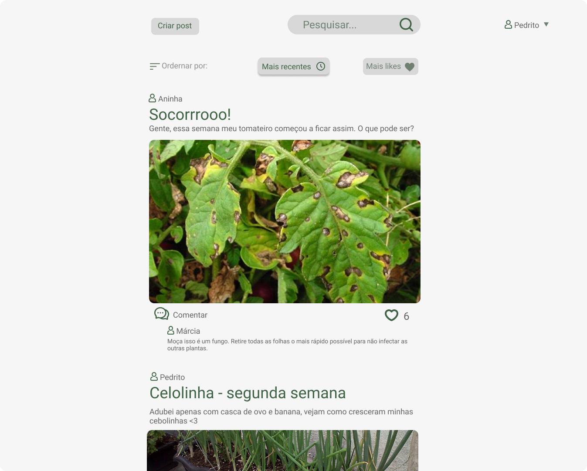

# Projeto Plantinhas

Plantinhas é uma rede social de incentivo ao cultivo de verduras, temperos e plantas ornamentais em casa. Aqui os usuários podem compartilhar o crescimento de suas plantas, além de pedir ajuda caso esteja enfrentando algum problema como aparecimento de fungos ou pragas.

## Principais funcionalidades:
- Criação de um post com imagem, título e descrição.
- Os posts poderão ter uma tag indicando se trata de uma dica / tutorial.
- Listagem dos posts podendo ordenar por mais recentes ou melhor avaliados.
- Opção de filtro para visualizar apenas as dicas.
- Comentar e dar like em posts.
- Pesquisa de posts.

## Principais telas:
- login / cadastro de usuário
- listagem dos posts com opção para ordernar via likes ou mais recentes 
- tela de criação de um post

## Proposta de interface:

